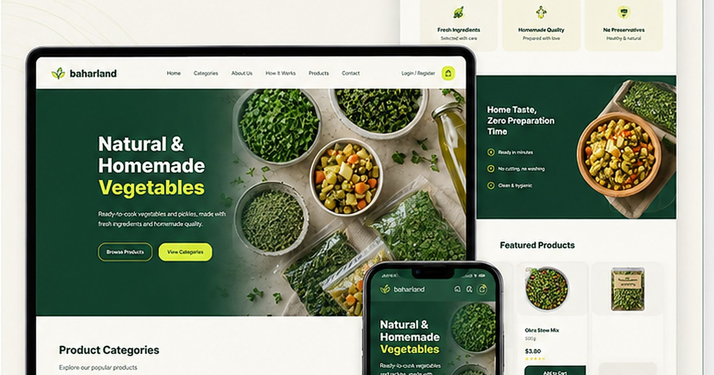

# Baharland

**E-Commerce Website · Client Project Portfolio Case Study**

## Overview

Modern e-commerce website for homemade food products such as ready-to-cook vegetables and pickles, focused on clean product presentation, category discovery, and easy ordering.

## My Contribution

- Storefront design and implementation
- Product/category presentation
- Responsive user experience
- Ordering-focused layout

## Technologies / Focus

- E-Commerce
- Responsive Design
- Product Presentation
- Category UX

## Source Code

The production source code is **not published** in this repository. This is a client-owned project, and this repository is intentionally limited to a portfolio case study and archived visual material.

## Portfolio Note

The screenshot above is an archived project preview from my portfolio records. A client's live website may have changed after delivery, so the current production site should not automatically be treated as an exact representation of the version shown here.

## Rights & Attribution

Client names, trademarks, logos, product photography, and other third-party visual assets remain the property of their respective owners. This repository documents my professional contribution and does not redistribute the underlying client codebase.
